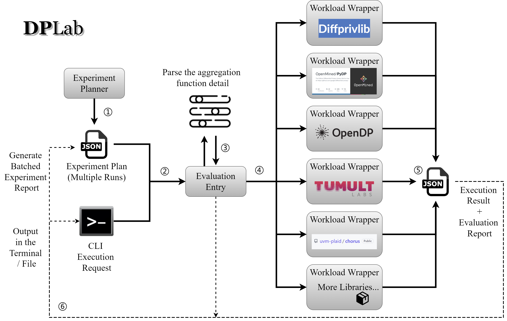

# DPLab: Benchmarking Differential Privacy Aggregation Operations

This repo targets to provide a unified interface to access and evaluate the same aggregation functionalities in different open-source differential privacy (DP) libraries. With a simple CLI, one can choose the library, the aggregation function, and many other experimental parameters and apply the specified DP measurement to data stored in a `.csv` file. The repo also provides both synthetic and real-world example datasets for evaluation purposes. Evaluation results are stored in a `.json` file and metrics are provided for repeated experiments. The repo also provides a CLI tool to generate configuration groups for larger-scale comparison experiments. 

## 1-Min Tutorial

Get hands-on in 1 minute with [**our tutorial notebook**](https://colab.research.google.com/drive/1jtsiCW-pQwOlIlQHpKgN_PbSjpReiTIw?usp=sharing).



**Currently supported aggregation operations**: 
- COUNT
- SUM
- MEAN
- VAR
- MEDIAN 
- QUANTILE

**Currently supported libraries**:
- diffprivlib 0.5.2 [[Homepage](https://github.com/IBM/differential-privacy-library)] [[Example Usage](./src/dplab/library_workload/diffprivlib.py)]
- python-dp 1.1.1 [[Homepage](https://github.com/OpenMined/PyDP)] [[Example Usage](./src/dplab/library_workload/pydp.py)]
- opendp 0.6.1 [[Homepage](https://opendp.org/)] [[Example Usage](./src/dplab/library_workload/opendp.py)]
- tmlt.analytics 0.4.1 [[Homepage](https://docs.tmlt.dev/analytics/latest/index.html)] [[Example Usage](./src/dplab/library_workload/tmlt.py)]
- chorus 0.1.3 [[Homepage](https://github.com/uvm-plaid/chorus)] [[Example Usage](./src/dplab/library_workload/chorus.py)]

## Installation

Clone the repo, switch the working directory, and install the dependencies
```
git clone git@github.com:camelop/dp_lab.git
cd dp_lab
pip install -e .
```

To use [tmlt](https://docs.tmlt.dev/analytics/latest/installation.html)
```
export PYSPARK_PYTHON=/usr/bin/python3
sudo apt install openjdk-8-jre-headless
pip3 install -i https://d3p0voevd56kj6.cloudfront.net python-flint
pip3 install tmlt.analytics
```

To use [chorus](https://github.com/uvm-plaid/chorus), please make sure you have Java runtime installed.


## How to run experiments in the benchmark

Generate the experiment commands, this will generate an `./exp.db.json` file under the working directory (you can also use `--location` to specify a different place).

```sh
dplab_exp plan --repeat 100 --group_num 100
```

Queue the experiments for execution
```sh
dplab_exp launch --debug
```

## How to run dp libraries in the benchmark

Run a specific library with the CLI

```sh
dplab_run <library> <operation> <input_file> <output_file> <other options>
```

For example:
```sh
dplab_run pydp sum data/1.csv data/1.json -f -r 1000
```

Other options include:
- `mode`: Evaluation mode, one can choose from "plain" (no timing/mem measurement), "internal" (internal measurement), or "external" (external tracking).
- `epsilon`: DP parameter.
- `quant`: Quantile value for QUANTILE operation, a float number between 0 and 1.
- `repeat`: How many time should the evaluation repeat.
- `force`: Force to overwrite the output file.
- `debug`: Include debugging information in the output file.
- `python_command`: Python command used to run the script in the external mode.
- `external_sample_interval`: timing/mem consumption sample interval in the external mode.

For more information, please check [the main entry file](./src/dplab/main.py).


### Generating synthetic data

```sh
# Make sure you are in the root directory of the repo
# Data will be generated in the ./data/ directory
# The procedure will generate about 28GB of data
# To avoid the risk of running out of disk space, you can comment out the performance test lines (Line26-27) in SYN_TARGETS defined in the script
python3 scripts/gen_data.py
```
